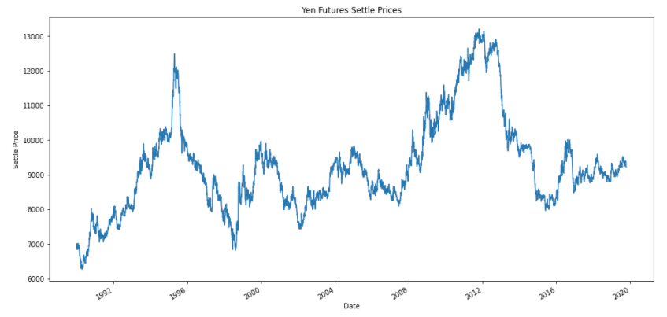
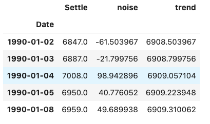
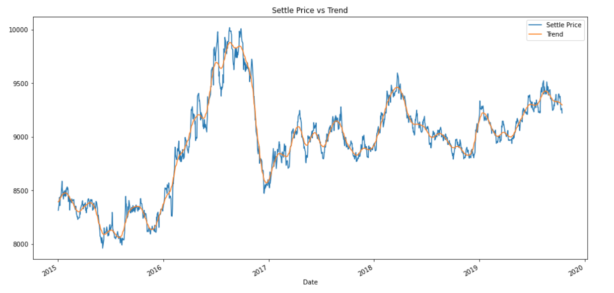
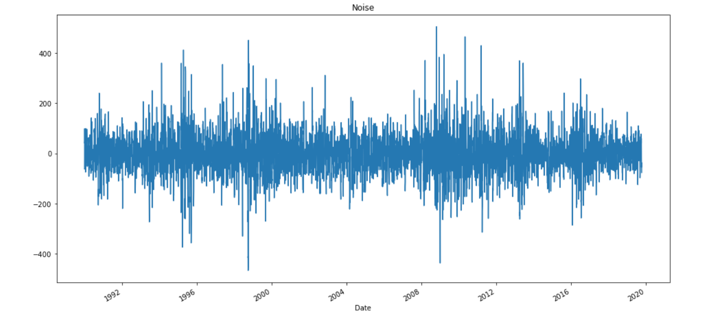
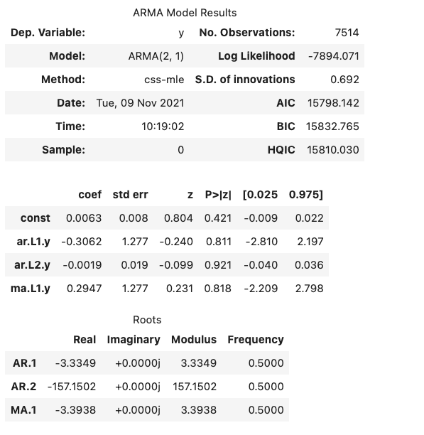
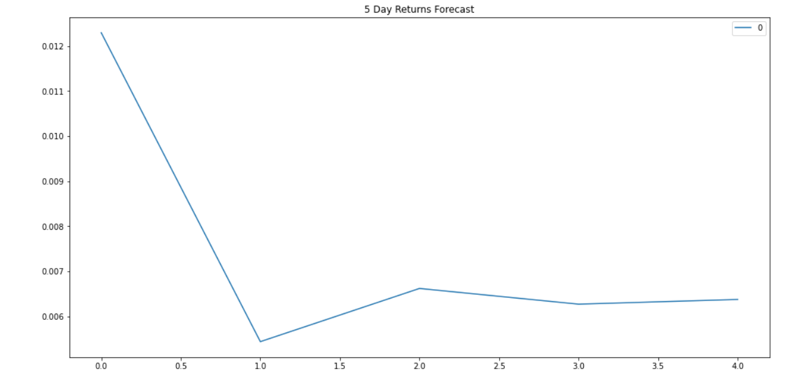
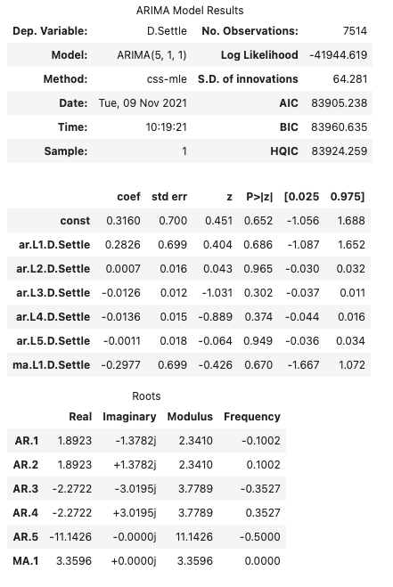
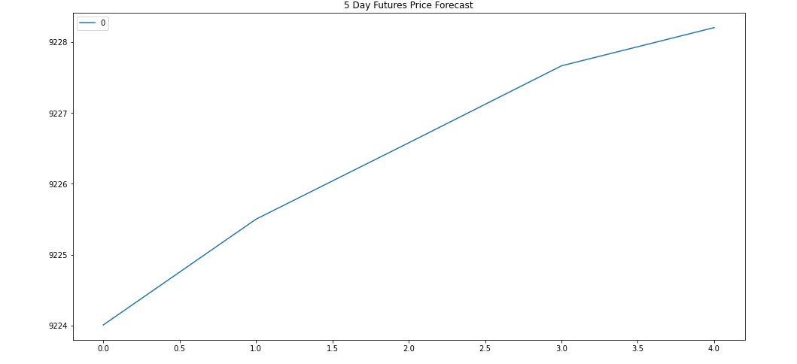
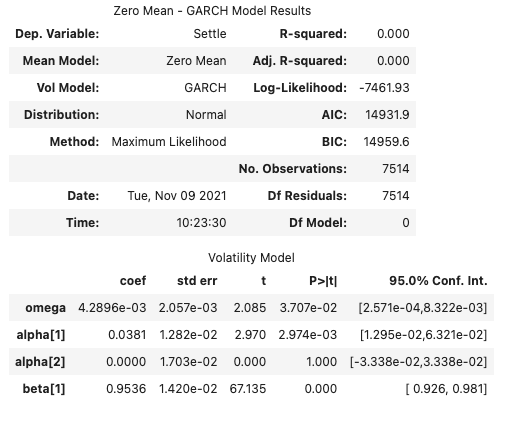
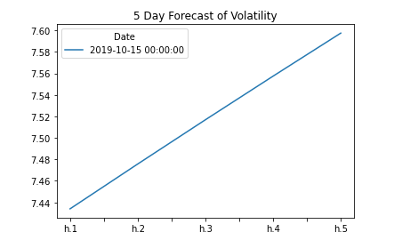

# A Yen for the Future

## Background

The financial departments of large companies often deal with foreign currency transactions while doing international business. As a result, they are always looking for anything that can help them better understand the future direction and risk of various currencies. Hedge funds, too, are keenly interested in anything that will give them a consistent edge in predicting currency movements.

I will test the many time-series tools that I have learned in order to predict future movements in the value of the Japanese yen versus the U.S. dollar.

I will use the following:

1. Time Series Forecasting
2. Linear Regression Modeling

- - -

## Files

Use the following starter code to complete this assignment. 

Note: The starter code shows example calculations and figures to use as a guide. However, your actual output may differ depending on the code and data used.

[Time-Series Starter Notebook](Notebooks_and_Data/time_series_analysis.ipynb)

[Linear Regression Starter Notebook](Notebooks_and_Data/regression_analysis.ipynb)

[Yen Data CSV File](Notebooks_and_Data/yen.csv)

- - -

### Time-Series Forecasting

In this notebook, I loaded historical Dollar-Yen exchange rate futures data and applied time series analysis and modeling to determine whether there is any predictable behavior.

1. Return Forecasting: Initial Time-Series Plotting
 

It is difficult to determine if there are any long-term or short-term patterns.

2. Decomposition using a Hodrick-Prescott Filter (Decompose the Settle price into trend and noise).
Using a Hodrick-Prescott Filter, I decomposed the Settle price into a trend and noise.

 

This is the plot of Settle Price VS Trend. There are spikes that go above and below the trend.

 

This is the plot of the Settle Noise.  

3. Forecasting Returns using an ARMA Model.

This is the ARMA Model Results and the ARMA 5 day Yen Returns Plot

The P>|z| column is the p-value of the coefficient. It is really important to check these p-values before you continue using the model. Notice that p-value is greater than 0.05. Thus the coefficient is unreliable and that can cause misleading results; the model is not a good fit

The model forecasts in 5 days the Yen returns will decrease from 0.012 to 0.006.

 

4. Forecasting the Settle Price using an ARIMA Model.

This is the ARIMA Model Results and the ARIMA 5 day Plot

Notice that p-value is greater than 0.05. Thus the coefficient is unreliable and that can cause misleading results; the model is not a good fit.

The model forecasts in 5 days the Yen will increase to 9228

5. Forecasting Volatility with GARCH.

This is the GARCH Model Results and the GARCH 5 Day Forcast of Volatility

The p-values are all less than 0.05. Notice that alpha[2] has a p-value of 1, but it not significant because its coefficient is 0. This model is a good fit.

The model forecasts in 5 days the volatility will increase.

#### Conclusion

According to the ARMA model, the Japanese Yen returns will decrease. On the other hand, according to the ARIMA models, the Japanese Yen price will increase.

Another factor to consider is unreliable coefficients which may cause misleading results because the p-values are all greater than 0.05. 

Based on the GARCH forecast, the risk of volatility for the Yen will increase each day.

So based on increasing prices with decreasing returns and increased risk of volatility, I would not buy the Yen

Because p-values are not lower than 0.05 for ARMA and ARIMA, I would not feel confident using these models for trading. I would consider the GARCH model for volatility.

### Linear Regression Forecasting

In this notebook, I built a Scikit-Learn linear regression model to predict Yen futures ("settle") returns with *lagged* Yen futures returns and categorical calendar seasonal effects (e.g., day-of-week or week-of-year seasonal effects).

1. Data Preparation (Creating Returns and Lagged Returns and splitting the data into training and testing data)
DP_returns_head_tail
DP_lagged_returns_head_tail

2. Fitting a Linear Regression Model.

3. Making predictions using the testing data.

4. Out-of-sample performance.

5. In-sample performance.

Use the results of the linear regression analysis and modeling to answer the following question:

* Does this model perform better or worse on out-of-sample data compared to in-sample data?

- - -

### Hints and Considerations

* Out-of-sample data is data that the model hasn't seen before (Testing data).
* In-sample data is data that the model was trained on (Training data).

### Submission

* Create Jupyter Notebooks for the analysis and host the notebooks on GitHub.

* Include a Markdown that summarizes your models and findings and include this report in your GitHub repo.

* Submit the link to your GitHub project to Bootcampspot.

- - -

### Requirements

#### Time Series Forecasting  (20 points)

##### To receive all points, your code must:

* Utilize the Hodrick-Prescott Filter to decompose the settle price into trend and noise. (5 points)
* Use the ARMA Model to forecast returns. (5 points)
* Use the ARIMA Model to forecast returns. (5 points)
* Use the GARCH Model to forecast returns. (5 points)
#### Time Series Analysis  (15 points)

##### To receive all points, your code must:

* Analyze the yen to decide whether to make a purchase. (5 points)
* Analyze the risk of the yen. (5 points)
* Analyze the confidence of models as a basis for trading. (5 points)

#### Linear Regression Forecasting  (30 points)

##### To receive all points, your code must:

* Prepare the data, create returns and lagged returns, then split the data into training and testing sets. (5 points)
* fit a linear Regression model to the data. (5 points)
* Make predictions using the testing data. (6 points)
* Evaluate the out-of-sample performance. (7 points)
* Evaluate the In-sample performance. (7 points)

#### Linear Regression Analysis  (5 points)

##### To receive all points, your code must:

* Analyze the model performance for out-of-sample and in-sample data and write a conclusion. (5 points)

#### Coding Conventions and Formatting (10 points)

##### To receive all points, your code must:

* Place imports at the beginning of the file, just after any module comments and docstrings and before module globals and constants. (3 points)
* Name functions and variables with lowercase characters and with words separated by underscores. (2 points)
* Follow Don't Repeat Yourself (DRY) principles by creating maintainable and reusable code. (3 points)
* Use concise logic and creative engineering where possible. (2 points)

#### Deployment and Submission (10 points)

##### To receive all points, you must:

* Submit a link to a GitHub repository that’s cloned to your local machine and contains your files. (5 points)
* Include appropriate commit messages in your files. (5 points)

#### Code Comments (10 points)

##### To receive all points, your code must:

* Be well commented with concise, relevant notes that other developers can understand. (10 points)

---

© 2021 Trilogy Education Services
