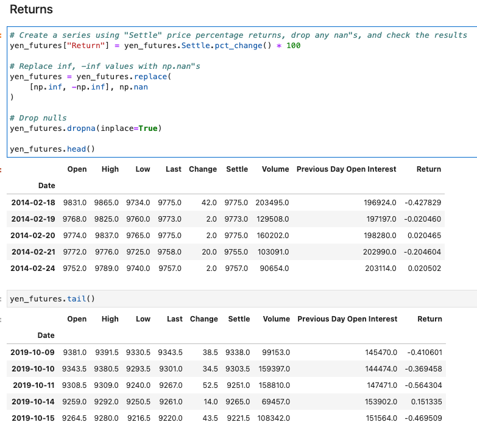
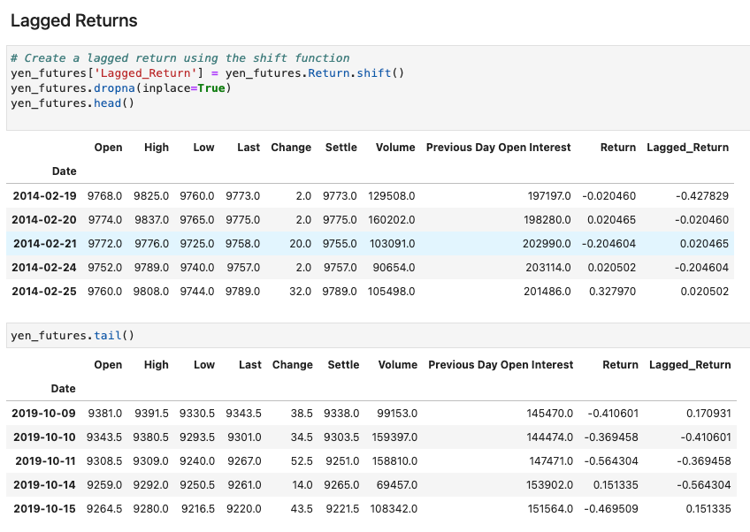
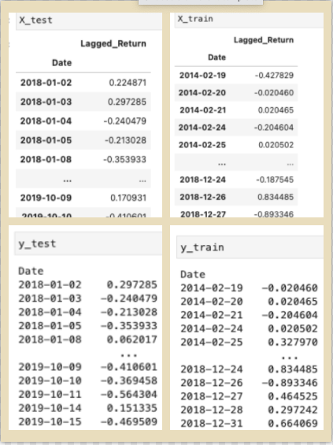
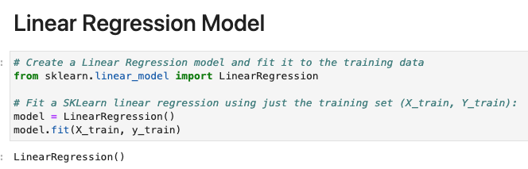
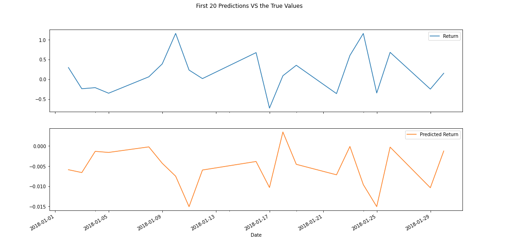
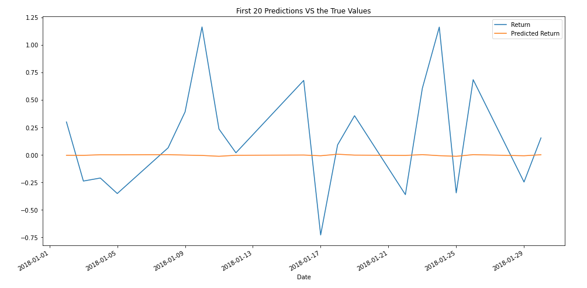
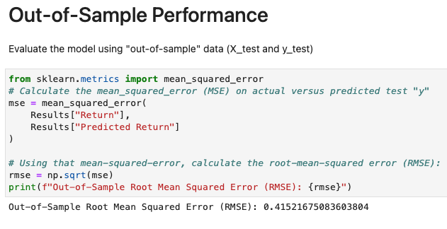
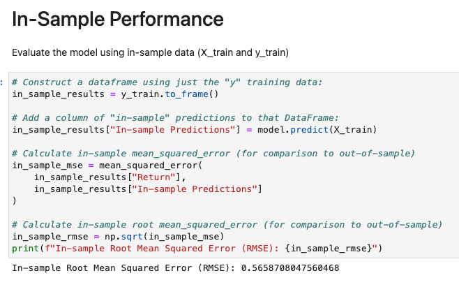

# A Yen for the Future

## Background

The financial departments of large companies often deal with foreign currency transactions while doing international business. As a result, they are always looking for anything that can help them better understand the future direction and risk of various currencies. Hedge funds, too, are keenly interested in anything that will give them a consistent edge in predicting currency movements.

I will test the many time-series tools that I have learned in order to predict future movements in the value of the Japanese yen versus the U.S. dollar.

I will use the following:

1. Time Series Forecasting
2. Linear Regression Modeling

- - -

## Files

Use the following starter code to complete this assignment. 

Note: The starter code shows example calculations and figures to use as a guide. However, your actual output may differ depending on the code and data used.

[Time-Series Starter Notebook](Notebooks_and_Data/time_series_analysis.ipynb)

[Linear Regression Starter Notebook](Notebooks_and_Data/regression_analysis.ipynb)

[Yen Data CSV File](Notebooks_and_Data/yen.csv)

- - -

### Time-Series Forecasting

In this notebook, I loaded historical Dollar-Yen exchange rate futures data and applied time series analysis and modeling to determine whether there is any predictable behavior.

1. Return Forecasting: Initial Time-Series Plotting
 

It is difficult to determine if there are any long-term or short-term patterns.

2. Decomposition using a Hodrick-Prescott Filter (Decompose the Settle price into trend and noise).
Using a Hodrick-Prescott Filter, I decomposed the Settle price into a trend and noise.

 

This is the plot of Settle Price VS Trend. There are spikes that go above and below the trend.

 

This is the plot of the Settle Noise.  

3. Forecasting Returns using an ARMA Model.

This is the ARMA Model Results and the ARMA 5 day Yen Returns Plot

The P>|z| column is the p-value of the coefficient. It is really important to check these p-values before you continue using the model. Notice that p-value is greater than 0.05. Thus the coefficient is unreliable and that can cause misleading results; the model is not a good fit

The model forecasts in 5 days the Yen returns will decrease from 0.012 to 0.006.

 

4. Forecasting the Settle Price using an ARIMA Model.

This is the ARIMA Model Results and the ARIMA 5 day Plot

Notice that p-value is greater than 0.05. Thus the coefficient is unreliable and that can cause misleading results; the model is not a good fit.

The model forecasts in 5 days the Yen will increase to 9228

5. Forecasting Volatility with GARCH.

This is the GARCH Model Results and the GARCH 5 Day Forcast of Volatility

The p-values are all less than 0.05. Notice that alpha[2] has a p-value of 1, but it not significant because its coefficient is 0. This model is a good fit.

The model forecasts in 5 days the volatility will increase.

#### Conclusion

According to the ARMA model, the Japanese Yen returns will decrease. On the other hand, according to the ARIMA models, the Japanese Yen price will increase.

Another factor to consider is unreliable coefficients which may cause misleading results because the p-values are all greater than 0.05. 

Based on the GARCH forecast, the risk of volatility for the Yen will increase each day.

So based on increasing prices with decreasing returns and increased risk of volatility, I would not buy the Yen

Because p-values are not lower than 0.05 for ARMA and ARIMA, I would not feel confident using these models for trading. I would consider the GARCH model for volatility.

- - -

### Linear Regression Forecasting

In this notebook, I built a Scikit-Learn linear regression model to predict Yen futures ("settle") returns with *lagged* Yen futures returns and categorical calendar seasonal effects (e.g., day-of-week or week-of-year seasonal effects).

1. Data Preparation (Creating Returns and Lagged Returns and splitting the data into training and testing data)

2. Fitting a Linear Regression Model.

3. Making predictions using the testing data.
I want to evaluate the model using data that it has never seen before, in this case: X_test.

I also plotted the first 20 predictions against the true values in the same plot to see how it performed

4. Out-of-sample performance.

I evaluated the model using "out-of-sample" data (X_test and y_test). The Out-of-Sample Root Mean Squared Error (RMSE) is 0.41521675083603804.

5. In-sample performance.

I evaluated the model using in-sample data (X_train and y_train). The In-sample Root Mean Squared Error (RMSE) is 0.5658708047560468

#### Does this model perform better or worse on out-of-sample data compared to in-sample data?

The training (in-sample) RMSE is 0.57 and the testing (out-of-sample) RMSE is 0.42. The model performs better on in sample data than the out-of-sample data.

- - -

